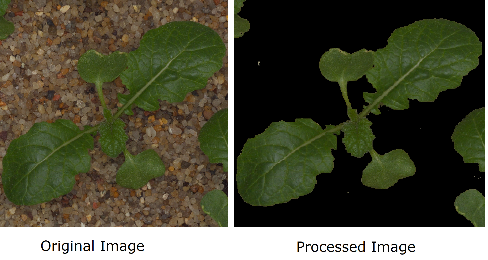
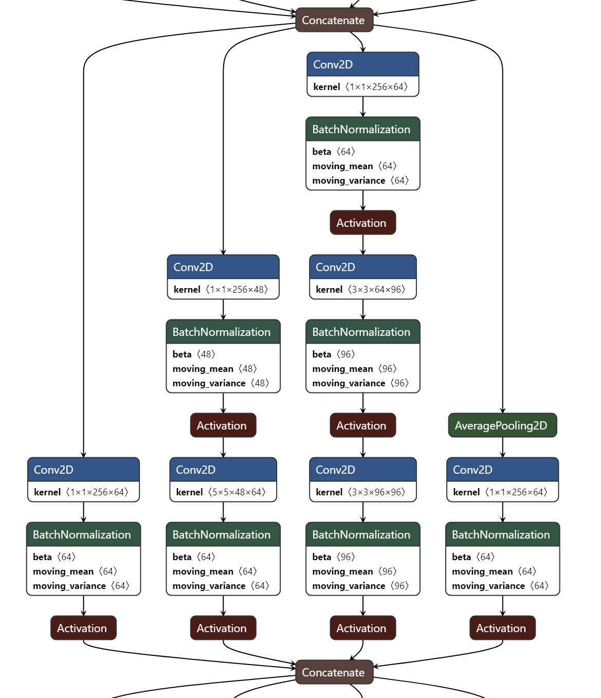

## Plant Seedlings Classification (Determine the species of a seedling from an image)
This repository contains my solution of [Plant Seedlings Classification](https://www.kaggle.com/c/plant-seedlings-classification), a Kaggle contest. This repository demonstrates training an [Inception](https://arxiv.org/abs/1512.00567) model with pre-trained ImageNet weights. Transfer learning without fine-tuning is used to train the layers on top of the Inception model in [transfer_learning_without_fine_tuning.py](https://github.com/Safayet-Khan/Kaggle-Competition-Plant-Seedlings-Classification/blob/main/transfer_learning_without_fine_tuning.py) script. In the [fine_tuning_plant.py](https://github.com/Safayet-Khan/Kaggle-Competition-Plant-Seedlings-Classification/blob/main/fine_tuning_plant.py) script, the whole model will be trained with a small learning rate for fine-tuning purposes.

### Install
This project requires **Python** and the following Python libraries installed:
- [NumPy](https://www.numpy.org/)
- [Pandas](https://pandas.pydata.org/)
- [matplotlib](https://matplotlib.org/)
- [TensorFlow](https://www.tensorflow.org/)
- [OpenCV](https://opencv.org/)
- [split-folders](https://pypi.org/project/split-folders)
- [glob](https://docs.python.org/3/library/glob.html)
- [os](https://docs.python.org/3/library/os.html)

If you do not have Python installed yet, it is highly recommended that you install the [Anaconda](https://www.anaconda.com/) distribution of Python, which already has most of the above packages. 

### Short Description of Each File
1. **color_extraction.py**- This script extracts the green color of the leaves and saves the processed images in another directory. I wrote this script, for removing the background noise from the images. At first, the RGB image is converted to an HSV(Hue-Saturation-Value) value. Then the green color is extracted from the image. The rest of the part of the image is blacked out for removing noise. This is done for all of the train set and the test set images.

After running **color_extraction.py** script, image looks like this:  

2. **random_split.py**- According to [François Chollet](https://fchollet.com/), creator and project lead of [Keras- Deep learning library](https://keras.io/),

>"Correct. The validation data is picked as the last 10% (for instance, if validation_split=0.9) of the input. The training data (the remainder) can optionally be shuffled at every epoch (shuffle argument in fit). That doesn't affect the validation data, obviously, it has to be the same set from epoch to epoch." [GitHub Post Link](https://github.com/keras-team/keras/issues/597).  

So, that's why I use [split-folders](https://pypi.org/project/split-folders) to randomly shuffle my data while making train set and validation set. Note that, I copy-pasted [Plant Seedlings Classification](https://www.kaggle.com/c/plant-seedlings-classification) test images folder in my data directory. 

3. **transfer_learning_without_fine_tuning.py**- This script demonstrates training an [Inception](https://arxiv.org/abs/1512.00567) model with pre-trained ImageNet. Transfer learning without fine-tuning is used to train the layers on top of the Inception model. This model is run for 30 epochs. 

4. **fine_tuning_plant.py**- I fine-tuned the previous model (transfer_learning_without_fine_tuning.py) unfreezing the whole Inception model. The whole model was trained with a very small learning rate. This model is run for 100 epochs and the best model was used for final submission. 

Graphically visualizating part of the Inception model: [(Link of graphical visualization of the full model)](https://github.com/Safayet-Khan/Kaggle-Competition-Plant-Seedlings-Classification/blob/main/Image/full_model.png)  

### Kaggle Data and Kernel
- [Plant Seedlings Processed Data](https://www.kaggle.com/safayet42/plantseedlings)- Kaggle contest [Plant Seedlings Classification](https://www.kaggle.com/c/plant-seedlings-classification), hosted by [COMPUTER VISION AND BIOSYSTEMS SIGNAL PROCESSING GROUP](https://vision.eng.au.dk/plant-seedlings-dataset/). Plant Seedlings Classification data copyright and license belong to COMPUTER VISION AND BIOSYSTEMS SIGNAL PROCESSING GROUP. I processed this Plant Seedlings Classification data and restructured it, for my own convenience.  
- [plant_seedlings_TL_WO_fine_tuning](https://www.kaggle.com/safayet42/plant-seedlings-tl-wo-fine-tuning)- This notebook demonstrates training an [Inception](https://arxiv.org/abs/1512.00567) model with pre-trained ImageNet weights to classify the ["Plant Seedlings Classification"](https://www.kaggle.com/c/plant-seedlings-classification) contest. Transfer learning without fine-tuning is used to train the layers on top of the Inception model. This model is run for 30 epochs.
- [plant_seedlings_with_ft](https://www.kaggle.com/safayet42/plant-seedlings-with-ft)- This notebook demonstrates training an [Inception](https://arxiv.org/abs/1512.00567) model with pre-trained ImageNet weights for the ["Plant Seedlings Classification"](https://www.kaggle.com/c/plant-seedlings-classification) contest. I fine-tuned the previous model [(plant_seedlings_TL_WO_fine_tuning)](https://www.kaggle.com/safayet42/plant-seedlings-tl-wo-fine-tuning) for this purpose. The whole model will be trained with a very small learning rate. This model is run for 100 epochs and the best model was used for final submission.

### Result
My best submission result was **0.96095 on both Private Score and Public Score**. This Kaggle contest was over almost three years ago, so I did not get my score to Leaderboard.   
  

### Reference
- [Plant Seedlings Classification](https://www.kaggle.com/c/plant-seedlings-classification)
- [COMPUTER VISION AND BIOSYSTEMS SIGNAL PROCESSING GROUP](https://vision.eng.au.dk/plant-seedlings-dataset/)
- [Rethinking the Inception Architecture for Computer Vision](https://arxiv.org/abs/1512.00567)
- [A Public Image Database for Benchmark of Plant Seedling Classification Algorithms](https://arxiv.org/abs/1711.05458)
